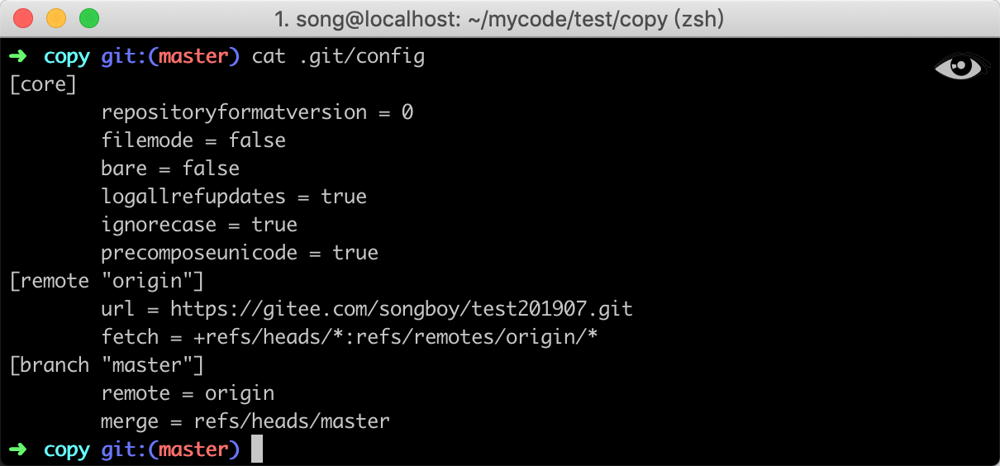

# git 常用操作

## 基础操作

| 操作                    | 命令                                  |
| ----------------------- | ------------------------------------- |
| 初始化仓库              | `git init`                            |
| 克隆仓库                | `git clone <url>`                     |
| 检查本地文件状态        | `git status `                         |
| 将文件加入缓存区        | `git add <file>`                      |
| 忽略文件                | `echo <file> >> .gitignore `          |
| 提交更新                | `git commit`                          |
| 移除本地文件            | `rm <file>`<br>`git rm <file>`        |
| 移除缓存文件            | `git rm --cached <file>`              |
| 移动文件                | `git mv <file_from> <file_to>`        |
| 更改最后一次提交        | `git commit --amend`                  |
| 取消暂存文件            | `git reset HEAD <file>`               |
| 撤消对文件的修改        | `git checkout -- <file>`              |
| 查看远程仓库            | `git remote -v`                       |
| 添加远程仓库            | `git remote add <shortname> <url> `   |
| 从远程仓库中抓取与拉取  | `git fetch [remote-name]`             |
| 推送到远程仓库          | `git push [remote-name][branch-name]` |
| 远程仓库的移除          | `git remote rm <shortname>`           |
| 查看本地分支  /所有分支 | `git branch` `git branch all`         |
| 查看分支：              | `git branch `                         |
| 创建分支：              | `git branch <name>`                   |
| 切换分支：              | `git checkout <name>`                 |
| 创建+切换分支：         | `git checkout -b <name>`              |
| 合并某分支到当前分支：  | `git merge <name>`                    |
| 删除分支：              | `git branch -d <name>`                |

### 客户端钩子

| 钩子名字           | 触发时间                                                     |
| ------------------ | ------------------------------------------------------------ |
| pre-commit         | 执行 `git commit` 命令完成前被执行。                         |
| prepare-commit-msg | 在执行完 `pre-commit` 钩子之后被调用。                       |
| commit-msg         | `git commit` 执行完成后被调用。                              |
| post-commit        | `post-commit` 钩子在 `commit-msg` 钩子之后立即被运行 。      |
| post-checkout      | `post-checkout` 钩子在使用 `git checkout` 命令时候会被调用。 |
| pre-rebase         | `pre-rebase` 钩子在使用 `git rebase` 命令发生更改之前运行    |
| pre-receive        | `pre-receive` 钩子在有人用 `git push` 向仓库推送代码时被执行。 |
| update             | `update` 钩子在 `pre-receive` 之后被调用，分别被每个推送上来的引用分别调用。 |
| post-receive       | 在成功推送后被调用，适合用于发送通知。                       |

一个简单的案例

```shell
#!/usr/local/bin/python3
import os
import sys

# 获取文件内容
def file_get_content(path):
    with open(path, "r") as f:
        ftextlist = f.read()  # 也是一次性读全部，但每一行作为一个子句存入一个列表
    return ftextlist

# 获取路径拼接命令
codePath = os.getcwd()
tempPath = "/tmp/shellresult"
cmd = "cd %s && git diff HEAD^..HEAD --stat   > %s" % (codePath, tempPath)
phpcsPath = "/Users/song/.composer/vendor/bin/phpcs"

# 执行后获取改动的文件列表
result = os.system(cmd)
ftextlist = file_get_content(tempPath).strip()

# 字符串分割将每个文件做一个元素
ftextlist = ftextlist.split("\n")

fileList = []
for value in ftextlist:
    # 通过字符串分割，获取文件名和其他信息
    tempArr = value.split(' ')
    # 如果路径中不包含.php字符，说明不是php文件，过滤它
    if '.php' not in tempArr[0]:
        continue

    # 拼接路径
    fullPath = os.path.join(codePath, tempArr[0])

    # 执行phpcs命令
    cmd = "%s %s > %s" % (phpcsPath, fullPath, tempPath)
    resultCode = os.system(cmd)
    
    #错误执行返回的状态码不等于0,说明有异常,状态码便输出非0
    if int(resultCode) != 0:
        print(file_get_content(tempPath))
        sys.exit(1)

#r如果上面都正常，则输出0，告诉Git代码正常
sys.exit(0)
```


1. 客户端钩子存放目录位于`.git/hooks` 下，需要有运行权限才会被触发；
2. 钩子支持多种语言，默认为了 shell 脚本，也可以指定 `Python` 或其他语言。

### 服务端钩子


### 修改最后一次提交
```
$ git commit -m 'initial commit'
    $ git add forgotten_file
    $ git commit --amend
```
### 忽略文件权限
1. Git 会记录文件的权限信息；
2. 可以通过配置忽略文件权限；
3. 忽略文件权限配置，支持按照版本库和全局。

git 会记录文件的权限，如果两个地方的文件权限不一样，拉取或者合并的时候就很可能导致代码冲突问题

```shell
#当前版本库
git config core.filemode false
#全局
git config --global core.fileMode false
#查看
cat .git/config
```
在配置文件中，如果看到 `fileMode false` 则代表配置成功，如下图所示：


